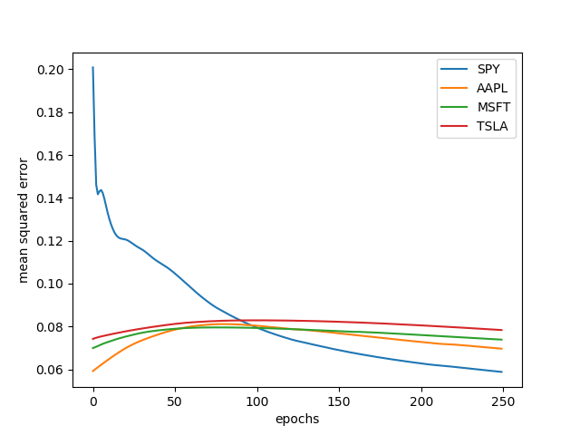
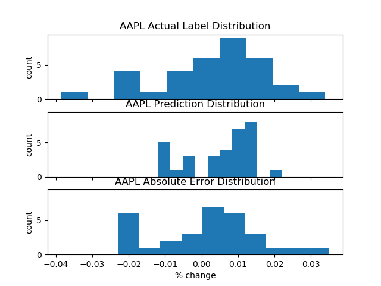

### Stocks_LSTM is a Python package for implementing TensorFlow machine learning models with live stock price and volume data.

        * Downloads and stores stock price and volume data
        * Converts raw data to tensors viable for machine learning with user defined functions
        * Uses TensorFlow models with any applicable layers
        * Stacks tensors for use with LSTM layers
        * Train, Verify, Evaluate, Repeat!

## Usage

### Pickel / IEX Backend

The `DataManager` object handles downloading and updating of price and volume data from the IEX API, where it can be stored  locally as a pickle file.

```python
symbols = ['SPY', 'AAPL', 'MSFT', 'TSLA']
index = 'SPY'
dm = DataManager('LIVEFORTUNE', symbols, trail_days=250)

data = dm.load_data()
data = dm.update(data)
dm.save_data(data)
```

### Inputs and Labels

The `Dataset` object handles all data processing to convert the price and volume data to the tensors required for ML.
Begin by defining some functions to classify the inputs for each day in the dataset, and one function to label each day with the value to be predicted.  In this case the label is a scalar; the percentage of return between open and close of that day for that asset.

```python
from functions import *
funcs = {
        'atr': atr,
        'percent_change': percent_change,
        'index_change': index_change,
        'volume_change': volume_change,
        'am_atr': am_atr,
        'am_price': am_price,
        'am_index': am_index,
        'am_volume': am_volume
        }

ds = Dataset(data, index=index, symbols=symbols, funcs=funcs, label_func=close_label)
```

Apply the input and label functions.  The results are normalized and the normalization parameters stored for later descaling.

```python
inputs, labels, scaled_inputs, scaled_labels = ga.dataset.run()
```

Split the dataset into a training and a validation set.  For this Example, the last 20% of the data is saved for validation.

```python
train_inputs, train_labels, val_inputs, val_labels = ga.dataset.split_data(scaled_inputs, scaled_labels, ratio=0.8)
```

### LSTM

LSTM is a form of Recurrent Neural Network and allows us to input a time series of each input.  Each training sample should be a non-overlapping time series and LSTM expects the data to be of shape `(samples, time_steps, inputs)`.  In this example, each sample is taken as three time steps (days of input).  

Validation data will not effect the model, so the data can be stacked in overlapping samples.

```python
stacked_train_inputs, stacked_train_labels, stacked_train_dts = ga.dataset.stack_inputs(train_inputs, train_labels, STACK_DAYS=3)

stacked_val_inputs, stacked_val_labels, stacked_val_dts = ga.dataset.stack_dense_inputs(val_inputs, val_labels, STACK_DAYS=3)
```

Note that the label data has shape `(samples, 1)` because it only uses the label from the last day of each time series.

```python
print('input data shape:', stacked_train_inputs[ga.index].shape)
>>>input data shape: (45, 3, 8)
print('label data shape:', stacked_train_labels[ga.index].shape)
>>>label data shape: (45, 1)
```

### The Tensorflow Model

The architecture used for this example is a somewhat naive implementation of LSTM with a total of five layers. The input layer is followed by an LSTM layer with 64 neurons.  The next layer is a dense layer of 64 neurons followed by a second LSTM layer.  The second LSTM layer has the `return_sequences=False` to reduce the time series back to a single value.  The final layer has only one neuron to represent the scalar output value.  Of course, an infinite number of architectures are possible and their discussion is beyond the scope of this example.

```python
def build_model(self, input_shape):
    model = keras.Sequential()
    model.add(keras.layers.LSTM(64, return_sequences=True, input_shape=input_shape, activation='tanh'))
    model.add(keras.layers.Dense(64))
    model.add(keras.layers.LSTM(64, return_sequences=False))
    loss = tf.keras.losses.MeanSquaredError()
    metrics=[tf.keras.metrics.MeanSquaredError()]
    model.compile(loss=loss, optimizer='adam', metrics=metrics)
ga.build_model((stacked_train_inputs[ga.index].shape[1], stacked_train_inputs[ga.index].shape[2]))

ga.model.summary()
```
```
>>>     Model: "sequential_1"
        _________________________________________________________________
        Layer (type)                 Output Shape              Param #   
        =================================================================
        lstm_1 (LSTM)                (None, 3, 64)             18688     
        _________________________________________________________________
        dense_1 (Dense)              (None, 3, 64)             4160      
        _________________________________________________________________
        lstm_2 (LSTM)                (None, 64)                33024     
        _________________________________________________________________
        dense_2 (Dense)              (None, 1)                 65        
        =================================================================
        Total params: 55,937
        Trainable params: 55,937
        Non-trainable params: 0
```

Notice `build_model` takes the shape of each sample as a contructor argument.  In this case it will be shape `(time_steps, inputs)`.  This choice of architecture has given a model with >55k trainable parameters.

### Training

Train the model on the dataset.  Each asset or stock symbol is trained seperately and the resulting weights and biases are stored.  

```python
history = ga.train_from_dataset(stacked_train_inputs,
                                stacked_train_labels,
                                epochs=250, patience = 100)
```

View the loss and monitored metrics.

```python
plot_errorloss(ga)
```



Note that all TensorFlow callbacks are disabled in this example, so the model will train for a set number of epochs.  At the end of training it will save the set of weights that resulted in the smallest loss for each symbol.  As a result, it is almost guaranteed to either overfit or underfit the data.

### Evaluate and Predict

Evaluate the performance of the model over the validation data.  In this case predictions are also obtained from the validation data, though in practice it would be a seperate set of data.

```python
evaluation = ga.eval_from_dataset(stacked_val_inputs, stacked_val_labels)
predictions = ga.predict_group(stacked_val_inputs)
```

### Results

A pandas `DataFrame` will give the loss and error for both training and validation sets as well as the prediction for the last day.

```python
res = results_df(ga, evaluation, descaled_predictions, labels)
print(res)
```
```
>>>             training_loss  training_mserror  eval_loss  eval_mserror  last_prediction
        TSLA       0.003207          0.017499   0.082297      0.017629        -0.076956
        SPY        0.003557          0.008716   0.047305      0.017518        -0.000732
        AAPL       0.003072          0.014042   0.052531      0.017543         0.002857
        MSFT       0.002932          0.014887   0.075343      0.017584         0.019959
```

A histogram for each symbol shows the actual labels vs. predicted labels and error over the predicted data.
Each symbol can be plotted to show the price activity, actual labels, predictions and error over the predicted data. To assess the asset with the highest prediction on the last day:

```
highest_pred = res.index[-1]
asset_plot(ga.dataset, highest_pred, labels, val_labels, stacked_val_dts, descaled_predictions)
histogram(ga.dataset, highest_pred, labels, val_labels, stacked_val_dts, descaled_predictions)
```



  As a result, the actual vs. prediction plot looks encouraging, but the error histogram less so.  Comparing the training loss to validation loss shows that the model is quite likely underfit.  The loss and error plots indicate the same, as loss and error were still decreasing for most symbols when it reached the last epoch.  More work would need done with this model.

### Future Work

* Callbacks.  This model, as shown, is still in need of an effective callback system to select the best weights to use for prediction.
* Tensorboard or a similar logging system will help to monitor weights and neural activity during training.
* Classification.  It may be beneficial to use a classification model as opposed to this regression model.  If each day is labeled with a list of boolean values, of which only one is true (strong down, down, flat, etc..), rather than a scalar(percent change).  This implementation might make neural activity easier to trace when comparing architectures.

A NOTE ON LIVE TIMING:  In order to be useful for 'same-day' predictions, the dataset must be able to compute valid inputs for the current day.  In this example, all inputs that begin with `'am_'` require an hour of am data to compute.  Also, IEX Stock data is delayed by 15 minutes.  So it will not compute a same day prediction until at least 75 minutes after market open.


