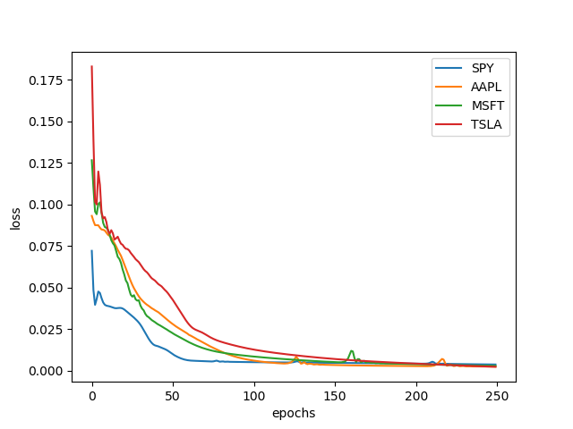

## Introduction


Stocks_LSTM is a Python package for implementing LSTM to predict returns from stock market assets.  
The package uses IEX for a backend.


## Usage

### Pickel / IEX Backend

Datamanager handles downloading, updating and verifying data from the IEX API.

```
symbols = ['SPY', 'AAPL', 'MSFT', 'TSLA']
index = 'SPY'
dm = DataManager('LIVEFORTUNE', symbols, trail_days=250)

data = dm.load_data()
data = dm.update(data)
dm.save_data(data)
```


### Inputs and Labels

Define some functions to define inputs for each day in the dataset, and one function to classify/label each day.  In this case the label is a scalar, the asset's percentage of return between open and close of that day.

```
from functions import *
funcs = {
        'atr': atr,
        'percent_change': percent_change,
        'index_change': index_change,
        'volume_change': volume_change,
        'am_atr': am_atr,
        'am_price': am_price,
        'am_index': am_index,
        'am_volume': am_volume
        }
```

```
ds = Dataset(data, index=index, symbols=symbols, funcs=funcs, label_func=close_label)
```

Apply the input and label functions.  They are all normalized and the normalization parameters stored for later descaling.

```
inputs, labels, scaled_inputs, scaled_labels = ga.dataset.run()
```

Split the dataset into a training and a validation set.  For this Example, the last 20% of the data is saved for validation.

```
train_inputs, train_labels, val_inputs, val_labels = ga.dataset.split_data(scaled_inputs, scaled_labels, ratio=0.8)
```

### LSTM

LSTM is a form of Recurrent Neural Network and allows us to input a time series of each input.  Each training sample should be a non-overlapping time series and LSTM expects the data to be of shape `(samples, time_steps, inputs)`.  In this example, each sample is taken as three time steps (days of input).  

Validation data will not effect the model, so the data can be stacked in overlapping samples.


```
stacked_train_inputs, stacked_train_labels, stacked_train_dts = ga.dataset.stack_inputs(train_inputs, train_labels, STACK_DAYS=3)

stacked_val_inputs, stacked_val_labels, stacked_val_dts = ga.dataset.stack_dense_inputs(val_inputs, val_labels, STACK_DAYS=3)
```

Note that the label data has shape `(samples, 1, 1)` because it only uses the label from the last day of each time series.


### The Tensorflow Model


The construction used for this example is a minimalistic LSTM model.  Other architectures are in the scope of further work on this project.

```
def build_model(self, input_shape):
    model = keras.Sequential()
    model.add(keras.layers.LSTM(16, return_sequences=True, input_shape=input_shape, activation='tanh'))
    model.add(Flatten())
    model.add(keras.layers.Dense(1))# , activation='selu')

    loss = tf.keras.losses.MeanSquaredError()
    metrics=[tf.keras.metrics.MeanSquaredError()]

    model.compile(loss=loss, optimizer='adam', metrics=metrics)
```
Notice `build_model` takes the shape of each sample as a contructor argument.  In this case it will be shape `(time_steps, inputs)`

```
ga.build_model((stacked_train_inputs[ga.index].shape[1], stacked_train_inputs[ga.index].shape[2]))

```

### Training

Train the model on the dataset.  Each asset or stock symbol is trained seperately and the resulting weights and biases are stored.  

```
history = ga.train_from_dataset(stacked_train_inputs,
                                stacked_train_labels,
                                epochs=250, patience = 100)
```

View the loss and monitored metrics.

```
plot_errorloss(ga)
```




### Evaluate and Predict

Evaluate the performance of the model over the validation data.  In this case predictions are also obtained from the validation data, though in practice it would be a seperate set of data.

```
evaluation = ga.eval_from_dataset(stacked_val_inputs, stacked_val_labels)
predictions = ga.predict_group(stacked_val_inputs)
```

### Results

A pandas `DataFrame` will give the loss and error for both training and validation sets as well as the prediction for the last day.  

```
res = results_df(ga, evaluation, descaled_predictions, labels)
print(res)
```
```
      training_loss  training_mserror  eval_loss  eval_mserror  last_prediction
MSFT       0.010943          0.034458   0.094462      0.043176        -0.021301
AAPL       0.008441          0.028631   0.104633      0.043139        -0.005763
SPY        0.004996          0.016167   0.050732      0.043096        -0.001297
TSLA       0.030815          0.043095   0.135939      0.043242         0.003076
```

A histogram for each symbol shows the actual labels vs. predicted labels and error over the predicted data.


Each symbol can be plotted to show the price activity, actual labels, predictions and error over the predicted data.


NOTE: IEX Stock data is delayed by 15 minutes and ..

